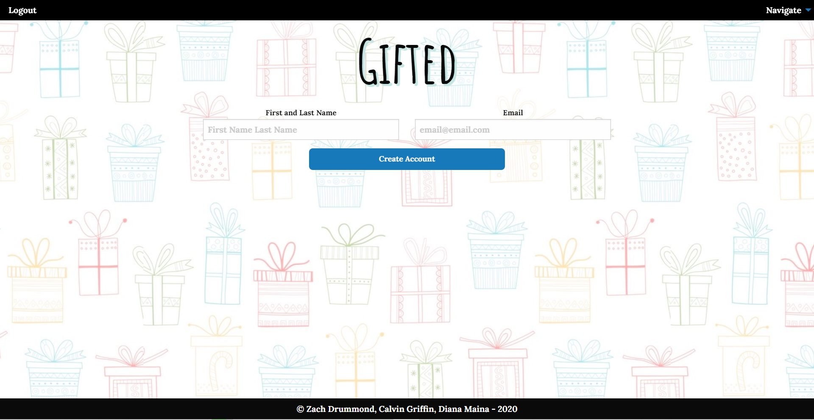
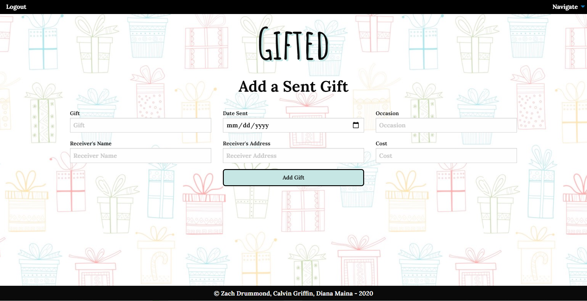

# Gifted

## Table of Contents

- [Description](#Description)
- [Links](#Links)
- [Design Elements](#Design-Elements)
- [App Preview](#App-Preview)
- [Future Development Ideas](#Future-Development-Ideas)
- [Credits](#Credits)
- [License](#License)

## Description

This is an app that tracks all of your gifts in one organized place. No need for sticky notes or spreadsheets any longer! There is a table that organizes all of the gifts you receive from others and a table that organizes all of the gifts that you send to others. You can add new gifts, or edit/delete current gifts.

### _Usage_

- Home Page

  1. Click the "Create an Account" button to create an account.
  2. If you have an account, add your email to the form and click the "Login" button.
  3. Once you are logged in, click one of the gift images at the bottom of the screen.

- Navigate Dropdown Menu

  1. Click the "View Received Gifts" button to go to the received gifts page.
  2. Click the "Add Received Gift" button to go to the add received gift page.
  3. Click the "View Sent Gifts" button to go to the sent gifts page.
  4. Click the "Add Sent Gifts" button to go to the add sent gift page.

- Logout Button

  1. Click the "Logout" button to go back to the login page.

- Sign Up Page

  1. Add your first and last name to the first form.
  2. Add your email address to the second form.
  3. Click the "Create Account" button.

- Received Gifts / Sent Gifts Page

  1. Click the "Order Gifts By" dropdown button to order the table in a different fashion.
  2. Click the "Add a New Gift" button to add a gift to the table.
  3. Click the "edit" button to edit one of the rows in the table. Make sure you click the "submit" button afterwards to update the row.
  4. Click the "delete" button to delete a row from the table.

- Add a New Gift Page
  1. Fill all of the forms with data/information.
  2. Click the "Add Gift" button to add the gift to the specified table.

## Links

- Website: http://gifted-project2.herokuapp.com/
- GitHub Repository: https://github.com/zachdrummond/gifted

## Design Elements

### _JavaScript_

- Node.js
- Node Package Manager - Express, Express-Handlebars, MySQL
- jQuery
- Model View Controller Architecture
- Sequelize Object Relational Mapper
- Models with Validation
- Routing
- Middleware Functions
- View Engine Templates
- Server-Side Rendering
- JSON
- Modules
- Promises
- DOM Manipulation
- AJAX
- Event Listeners
- Objects
- Methods
- Functions
- PORTs & Environment Variables
- For Loops
- If...else statements
- Comments

### _MySQL_

- Database
- Schema
- Tables
- Columns and Rows

### _Handlebars_

- Partials
- Triple Stash
- Double Stash
- Built-in Helpers
- Comments

### _CSS_

- Selectors
- Background Image and Color
- Image Animations
- Hover
- Cursor
- Position
- Padding and Margin
- Border Radius and Color
- Google Fonts
- Font Colors, Shadow, Sizes
- Comments

### _Foundation_

- Flex Grid System
- Mobile Responsive
- Tables
- Forms
- Title Bar
- Dropdown Menu
- Interchange
- Reveal Modals
- Callouts
- Buttons
- Alignment
- Colors

## App Preview

### Home Page

### Sign Up Page

### Gifts Received Page

### Add Gift Received Page

### Gifts Sent Page

### Add Gift Sent Page

## Future Development Ideas

- Customizable Themes
- Wish List
- Links to Gifts/Gift Registries
- Gift Suggestion Search Bar
- Calendar: Birthday Reminder
- Create an Account with Password
- Edit Account Email and/or Password

## Credits

### _Sources_

- https://nodejs.org/en/
- https://www.javascript.com/
- https://jquery.com/
- https://handlebarsjs.com/
- https://www.mysql.com/
- https://www.npmjs.com/package/express
- https://www.npmjs.com/package/config
- https://www.npmjs.com/package/sequelize
- https://www.npmjs.com/package/mysql
- https://www.npmjs.com/package/nodemon
- https://get.foundation/
- https://momentjs.com/
- https://www.heroku.com/

### _Collaborators_

- Zach Drummond - https://github.com/zachdrummond
- Calving Griffin - https://github.com/cgriffin332
- Diana Maina - https://github.com/dianamaina

## License

Copyright (c) 2020 Zach Drummond, Calvin Griffin, Diana Maina

Permission is hereby granted, free of charge, to any person obtaining a copy
of this software and associated documentation files (the "Software"), to deal
in the Software without restriction, including without limitation the rights
to use, copy, modify, merge, publish, distribute, sublicense, and/or sell
copies of the Software, and to permit persons to whom the Software is
furnished to do so, subject to the following conditions:

The above copyright notice and this permission notice shall be included in all
copies or substantial portions of the Software.

THE SOFTWARE IS PROVIDED "AS IS", WITHOUT WARRANTY OF ANY KIND, EXPRESS OR
IMPLIED, INCLUDING BUT NOT LIMITED TO THE WARRANTIES OF MERCHANTABILITY,
FITNESS FOR A PARTICULAR PURPOSE AND NONINFRINGEMENT. IN NO EVENT SHALL THE
AUTHORS OR COPYRIGHT HOLDERS BE LIABLE FOR ANY CLAIM, DAMAGES OR OTHER
LIABILITY, WHETHER IN AN ACTION OF CONTRACT, TORT OR OTHERWISE, ARISING FROM,
OUT OF OR IN CONNECTION WITH THE SOFTWARE OR THE USE OR OTHER DEALINGS IN THE
SOFTWARE.
